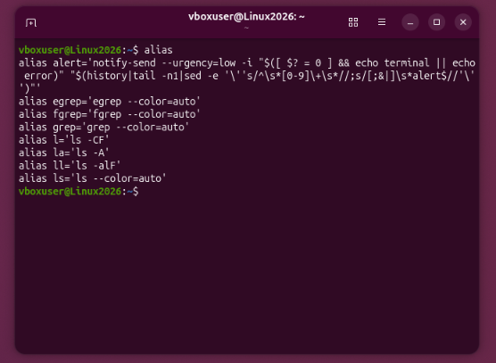

# Tarea 2 - Alias en Linux

## 1. Investigación: Qué son los alias y cómo listarlos

Un alias en Linux es un atajo que sirve para hacer más corto un comando que es muy largo o que usamos muy seguido. Nos ayuda a ahorrar tiempo al escribir en la terminal y a evitar equivocaciones con comandos complejos.

Para la investigación, encontré que el comando que sirve para ver la lista de todos los alias que están activos en nuestro sistema es:

```bash
alias
```



*Lo que pasa en la pantalla:* Al escribir el comando y dar Enter, la terminal nos muestra el listado de todos los atajos o nombres cortos que ya vienen guardados por defecto en el sistema operativo.

---

## 2. Práctica de la Diapositiva 15 (Paso a Paso)

### Paso 01: Buscar si el alias ya existe
Antes de cambiar un alias, usamos este comando para revisar si ya está escrito dentro de nuestro archivo de configuración .bashrc:

```bash
grep -n "alias ll=" ~/.bashrc
```


*Lo que pasa en la pantalla:* El comando busca la palabra exacta dentro del archivo y nos devuelve una línea de texto que nos indica en qué número de renglón se encuentra guardado.

### Paso 02: Guardar el nuevo alias personalizado
Para modificar el comportamiento del comando, usamos esta instrucción que escribe nuestra nueva regla al final del archivo de configuración:

```bash
printf "%s\n" "alias ll='ls -lah --color=auto'" >> ~/.bashrc
```


*Lo que pasa en la pantalla:* La terminal no muestra ningún mensaje abajo y pasa directo a una línea limpia. Esto significa que el comando se ejecutó bien y guardó el cambio dentro del archivo de forma permanente.

### Paso 03: Actualizar la configuración de la terminal
Como modificamos el archivo de configuración, usamos este comando para que la terminal se actualice de inmediato sin necesidad de cerrarla y volverla a abrir:

```bash
source ~/.bashrc
```


*Lo que pasa en la pantalla:* La terminal no muestra texto y se pasa al siguiente renglón. Esto nos indica que leyó el archivo correctamente y aplicó los cambios en el momento.

### Paso 04: Comprobar el resultado final
Para asegurarnos de que todo funcionó correctamente, le preguntamos a la terminal cuál es la función actual del comando modificado:

```bash
type ll
```


*Lo que pasa en la pantalla:* La terminal nos responde confirmando que el comando ya tiene guardados los nuevos cambios y parámetros que le asignamos en el Paso 2.
